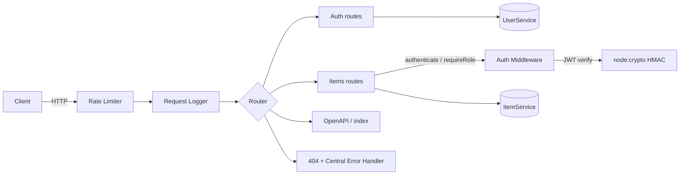

<div align="center">
  

  <h1>express-api-boilerplate</h1>

  <p><strong>A batteries-included, strict-TypeScript Express REST API starter — auth, validation, pagination, rate limiting, logging, and OpenAPI, with zero runtime dependencies beyond Express.</strong></p>

  <p><em>Built and maintained by Viprasol Tech</em></p>

  <p>
    <a href="https://github.com/Viprasol-Tech/express-api-boilerplate/actions"></a>
    <a href="LICENSE"></a>
    
    
    
    = 18" />
  </p>
</div>

A clean, production-shaped starting point for building REST APIs with Express and
TypeScript. It ships a listen-free `createApp()` factory (trivially testable),
centralized async error handling, and a full middleware stack — JWT auth, schema
validation, pagination/filtering, rate limiting, structured logging, typed config,
and a self-served OpenAPI document. Everything is built on Node built-ins, so the
only runtime dependency is Express itself.

## ✨ Features

- 🔐 **JWT auth (HS256)** — dependency-free `signJwt`/`verifyJwt` on `node:crypto`, an `authenticate` middleware, and a `requireRole()` RBAC guard.
- 👤 **Users & sessions** — `register` / `login` / `me` routes backed by a `UserService` with salted **scrypt** password hashing (hashes never leak).
- 🧪 **Schema validation** — `validateBody` and `validateQuery` with `required`, `min`/`max`, `enum`, and `pattern` rules; query params are type-coerced.
- 📄 **Pagination & filtering** — `GET /items?page&pageSize&search&category&minQuantity&sortBy&order` with clamped page sizes and rich response metadata.
- 🚦 **Rate limiting** — fixed-window limiter with `X-RateLimit-*` and `Retry-After` headers (429 on exceed).
- 📝 **Structured logging** — one JSON line per request, with a propagated `X-Request-Id` correlation id.
- ⚙️ **Centralized config** — one typed, validated `config` object instead of scattered `process.env` reads.
- 📚 **OpenAPI 3.0** — served live at `GET /openapi.json`, plus a self-describing route index at `GET /`.
- 🧯 **Typed HTTP errors** — `Http/NotFound/Validation/Unauthorized/Forbidden/Conflict/TooManyRequests` map cleanly to status codes.
- ✅ **Strict TypeScript** + **vitest + supertest** — 85 in-process tests, no real port required.

## 📦 Install

```bash
git clone https://github.com/Viprasol-Tech/express-api-boilerplate.git
cd express-api-boilerplate
npm install
```

## 🚀 Quickstart

```bash
npm test            # run the full suite (85 tests)
npm run build       # tsc -> dist/
npm start           # node dist/server.js  (PORT defaults to 3000)
```

```bash
# 1. Register a user
curl -s -X POST localhost:3000/auth/register \
  -H 'content-type: application/json' \
  -d '{"email":"jane@example.com","password":"supersecret"}'

# 2. Log in -> get a Bearer token
TOKEN=$(curl -s -X POST localhost:3000/auth/login \
  -H 'content-type: application/json' \
  -d '{"email":"jane@example.com","password":"supersecret"}' | jq -r .data.token)

# 3. Create an item (auth required)
curl -s -X POST localhost:3000/items \
  -H "authorization: Bearer $TOKEN" \
  -H 'content-type: application/json' \
  -d '{"name":"Widget","quantity":5,"category":"tools"}'

# 4. List with pagination + filtering (public)
curl -s "localhost:3000/items?category=tools&sortBy=quantity&order=desc&page=1&pageSize=10"
```

## 🛠 Usage

```ts
import { createApp, loadConfig } from "express-api-boilerplate";

// Override config for a test or an embedded deployment.
const app = createApp({
  config: { ...loadConfig(), rateLimitMax: 50, defaultPageSize: 25 },
});

app.listen(3000, () => {
  console.log("API listening on http://localhost:3000");
});
```

Use the building blocks directly in your own app:

```ts
import { Router } from "express";
import {
  authenticate,
  requireRole,
  validateBody,
  asyncHandler,
} from "express-api-boilerplate";

const router = Router();
const protect = authenticate({ secret: process.env.JWT_SECRET! });

router.post(
  "/reports",
  protect,
  requireRole("admin"),
  validateBody({ title: { type: "string", required: true, min: 3, max: 120 } }),
  asyncHandler(async (req, res) => {
    res.status(201).json({ data: { by: req.user!.id, title: req.body.title } });
  }),
);
```

## 🔌 API

| Method | Path              | Auth        | Description                                  |
| ------ | ----------------- | ----------- | -------------------------------------------- |
| GET    | `/`               | —           | Self-describing route index                  |
| GET    | `/health`         | —           | Liveness/readiness probe                     |
| GET    | `/openapi.json`   | —           | OpenAPI 3.0 document                          |
| POST   | `/auth/register`  | —           | Register a user (`409` on duplicate email)   |
| POST   | `/auth/login`     | —           | Authenticate, returns a Bearer JWT           |
| GET    | `/auth/me`        | Bearer      | Current authenticated user                   |
| GET    | `/items`          | —           | List items (paginated + filtered + sorted)   |
| GET    | `/items/:id`      | —           | Fetch one item (`404` if missing)            |
| POST   | `/items`          | Bearer      | Create an item (validated body)              |
| PATCH  | `/items/:id`      | Bearer      | Partially update an item                     |
| DELETE | `/items/:id`      | Bearer + admin | Delete an item (`204`)                     |

**List query params:** `page`, `pageSize` (clamped to `MAX_PAGE_SIZE`), `search`,
`category`, `minQuantity`, `sortBy` (`name`\|`quantity`\|`createdAt`), `order`
(`asc`\|`desc`).

### Configuration (env vars)

| Variable             | Default                       | Description                          |
| -------------------- | ----------------------------- | ------------------------------------ |
| `PORT`               | `3000`                        | Server port                          |
| `NODE_ENV`           | `development`                 | `development` \| `test` \| `production` |
| `JWT_SECRET`         | `dev-insecure-secret-change-me` | HMAC signing secret (set in prod!) |
| `JWT_EXPIRES_IN`     | `3600`                        | Token lifetime (seconds)             |
| `RATE_LIMIT_MAX`     | `100`                         | Requests per window per client       |
| `RATE_LIMIT_WINDOW_MS` | `60000`                     | Rate-limit window (ms)               |
| `DEFAULT_PAGE_SIZE`  | `20`                          | Default list page size               |
| `MAX_PAGE_SIZE`      | `100`                         | Hard cap on requested page size      |
| `LOG_REQUESTS`       | `true`                        | Toggle structured request logging    |

## 🧭 Architecture



## 🗺 Roadmap

- [x] JWT auth + role-based route guards
- [x] Body & query schema validation
- [x] Pagination, filtering, and sorting
- [x] Rate limiting + structured request logging
- [x] Centralized typed config
- [x] OpenAPI document endpoint
- [ ] Pluggable persistence adapter (Postgres/SQLite)
- [ ] Refresh-token rotation
- [ ] Swagger UI page served from the docs route

## ❓ FAQ

**Why no `jsonwebtoken` / `bcrypt` / `helmet` dependencies?**
To keep the starter lean and audit-friendly, auth (HS256) and password hashing
(scrypt) are built on Node's `crypto`. Swap in your preferred libraries any time —
the interfaces are small and isolated.

**Is the in-memory store production-ready?**
The `ItemService`/`UserService` and `rateLimit` use in-memory maps so the repo runs
with zero setup. The service layer isolates persistence — replace the maps with a
database client (and the limiter with Redis) without touching the HTTP routes.

**How do I test it?**
`createApp()` never calls `app.listen`, so supertest drives it in-process. See the
`test/` suite for unit and integration examples.

## 🤝 Contributing

Contributions are welcome! Please read [CONTRIBUTING.md](CONTRIBUTING.md) and our
[Code of Conduct](CODE_OF_CONDUCT.md) before opening a pull request. Run
`npm run typecheck && npm test` before submitting.

## Contact — Viprasol Tech Private Limited

- Website: [viprasol.com](https://viprasol.com)
- Email: [support@viprasol.com](mailto:support@viprasol.com)
- Telegram: [t.me/viprasol_help](https://t.me/viprasol_help) | WhatsApp: +91 96336 52112
- GitHub: [@Viprasol-Tech](https://github.com/Viprasol-Tech) | [LinkedIn](https://www.linkedin.com/in/viprasol/) | X [@viprasol](https://twitter.com/viprasol)

## License

[MIT](LICENSE) (c) 2025 Viprasol Tech Private Limited
